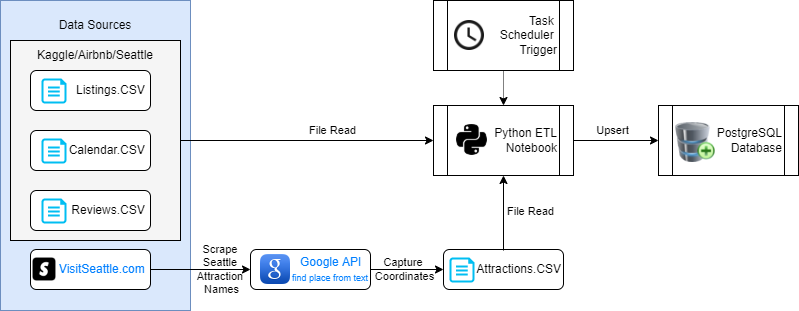

# ETLProject-Sleepless-in-Seattle
Contributors: 
 - [@briginmis](https://github.com/briginmis)
 - [@Waltontan](https://github.com/Waltontan)
 - [@Daniel-Bourke](https://github.com/Daniel-Bourke)

# Purpose and motivation

This repository demonstrates the process of extracting 2015-2016 Seattle AirBNB and tourism data, performing ETL and then loading the data in a database which can then be queried by the analyst. 

Following this ETL process, analysts will be able to analyse and provide insight into:
 - What a prospective host should charge for their stay?
 - Which factors contribute to high review scores?
 - Where are the cheapest stays in Seattle?
 - Which is the busiest time of the year?
 - Does price impact customer satisfaction?
 - What is the average distance between the properties and Seattle's landmarks?


This code repository contains the solution to perform the ETL on a scheduled basis, and store the data in a PostgreSQL Database. 

To provide confidence over the transformations applied, unit tests have also been written. Continuous integration pipelines have also been configured to automate the testing of code prior to merging to `main`.  

# Repo structure 
```
.github/workflows                           # contains continuous integration pipelines 
    |__ etl-ci.yml	                    # etl continuous integration

Images/                                     # contains images used for the README
    |__ ERD.PNG                      	    # Entity Relational Diagram
    |__ Solution_architexture_diagram.PNG   # Solution Architecture Diagram
    |__ task_scheduler_action.PNG           # Screenshot of task scheduler edit action
    |__ task_scheduler_actions.PNG          # Screenshot of task scheduler actions
    |__ task_scheduler_general.PNG          # Screenshot of task scheduler general
    |__ task_scheduler_trigger.PNG          # Screenshot of task scheduler trigger schedule
    |__ task_scheduler_triggers.PNG         # Screenshot of task scheduler triggers
    |__ CI_execution.PNG                    # Screenshot of successful continuous integration execution
    |__ unit_test_results.PNG               # Screenshot of successful unit test results

Resources/                                  # contains static datasets and cleaned datasets
    |__ listings.csv                        # initial csv 1
    |__ reviews.csv                         # initial csv 2
    |__ calendar.csv                        # initial csv 3
    |__ Attractions.csv                     # csv of Seattles top landmarks derived from Google API
    |__ Address_clean.csv                   # intermediate csv containing listing address information
    |__ Address_clean2.csv                  # final csv including distance column from seattle landmarks
    |__ Amenities_clean.csv                 # final csv of amenities (listing_id and amenity) 
    |__ Availability.csv                    # final csv of availability information for each listing.
    |__ Host_Verifications_Clean.csv        # final csv of verification methods used by the hosts
    |__ Host_clean.csv                      # final csv of information about each host
    |__ Pricing_clean.csv                   # final csv of pricing information for each listing
    |__ Property_clean.csv                  # final csv of the general information for each listing
    |__ Review_Statistics_clean.csv         # final csv of review statistics for each listing
    |__ calendar_clean.csv                  # final csv of information for each day for each listing

scripts/    
    |__ credentials.py                      # (already added to .gitignore)
    |__ Haversine_Function.py               # function that calculates the distance in km between 2 coordinate pairs
    |__ cleaning_functions.py               # custom user-generated transformation functions
    |__ test_transformation_functions.py    # pytest unit tests 
    |__ scrape.ipynb                        # notebook file that retrieves coordinates of top 25 seattle landmarks
    |__ scrape.py    			    # Python file that retrieves coordinates of top 25 seattle landmarks
    |__ calendar_cleaning.ipynb    	    # notebook file that applies cleaning functions to calendar csv 
    |__ calendar_cleaning.py    	    # Python file that applies cleaning functions to calendar csv
    |__ listing_clean.ipynb    		    # notebook file that applies cleaning functions to listings.csv and splits into various csv's
    |__ listing_clean.py    		    # Python file that applies cleaning functions to listings.csv and splits into various csv's 
    |__ Address_Final_ETL.ipynb    	    # notebook file that takes Address_clean.csv and Attractions.csv and applies haversine to get average distance from landmark 
    |__ Address_Final_ETL.py    	    # Python file that takes Address_clean.csv and Attractions.csv and applies haversine to get average distance from landmark 
    |__ Amenities_ETL.ipynb    		    # notebook file that applies the explode function from cleaning_functions.py to generate amenities.csv
    |__ Amenities_ETL.py    		    # Python file that applies the explode function from cleaning_functions.py to generate amenities.csv
    |__ Host_Verifications_ETL.ipynb        # notebook file that applies the explode function from the cleaning_functions.py to generate Host_verifications.csv
    |__ Host_Verifications_ETL.py           # Python file that applies the explode function from the cleaning_functions.py to generate Host_verifications.csv
    |__ quick_database_diagrams_script.txt  # TXT script used in quickdatabasediagrams
    |__ ddl_create_table.sql                # SQL code used to create the target tables 

README.md                                   # all you need to know is in here 
Requirements.txt                            # python dependencies 
```

# Solution 

## Solution architecture 

The solution architecture diagram was created using: https://draw.io/ 





The **E**xtract, **T**ransform, and **L**oad steps are explained below. 

<details>
<summary><strong> Extract </strong></summary>

#### Data sources 
Data is extracted from the following data sources. 

| No | Data Source | Description | Source Type | URL | 
| - | - | - |- | - |
| 1 | Listings.csv | Contains details of each listing | CSV | https://www.kaggle.com/airbnb/seattle?select=listings.csv | 
| 2 | Calendar.csv | Contains the availability and price of each listing for each date | CSV | https://www.kaggle.com/airbnb/seattle?select=calendar.csv |
| 3 | Reviews.csv | Contains the text commentary for each review | CSV | https://www.kaggle.com/airbnb/seattle?select=reviews.csv 
| 4 | Visit Seattle | Top 25 attractions in Seattle | HTML | https://visitseattle.org/things-to-do/sightseeing/top-25-attractions/ 
| 5 | Google Text Search | Contains coordinates of locations | API | https://developers.google.com/maps/documentation/places/web-service/search-text | 

</details>

<details>
<summary><strong> Transform </strong></summary>


The following transformation scripts are executed: 
| Script | Input CSV | Output CSV |  
| - | - |- |
| [Address_Final_ETL.ipynb](Scripts/Address_Final_ETL.ipynb) | `Address_clean`,`Attractions` | `Address_clean2` |
| [Amenities_ETL.ipynb](Scripts/Amenities_ETL.ipynb) | `listings` | `Amenities_clean` |
| [calendar_cleaning.ipynb](Scripts/calendar_cleaning.ipynb) | `calendar` | `calendar_clean` | 
| [Host_Verifications_ETL.ipynb](Scripts/Host_Verifications_ETL.ipynb) | `listings` | `Host_Verifications_Clean` |
| [listing_clean.ipynb](Scripts/listing_clean.ipynb) | `listings` | `Property_clean`, `Address_clean`, `Host_clean`, `Review_Statistics_clean`, `Pricing_clean`, `Availability`|
| [scrape.ipynb](Scripts/scrape.ipynb) | `Visit Seattle (website)`,`Google Places API` | `Attractions` |


All `.ipynb` notebooks are converted to `.py` by running the code below: 
```sh
python -m jupyter nbconvert --to python <notebook name>.ipynb
```
</details>


<details>
<summary><strong> Load </strong></summary>


#### Loading process 
Data is loaded into the PostgreSQL using an upsert (insert/update) statement. 

1. Attempt to insert the records 
2. If fail due to records already existing, then update records 

</details>

# ERD and Data Dictionary

### Entity Relationship Diagram 

The ERD diagram was created using: https://app.quickdatabasediagrams.com/#/


The Data Definition Language (DDL) used to create the tables can be found [here](Scripts/ddl_create_table.sql). 

### Data dictionary 

Below are the data definitions for the following tables: 
<details>
<summary><strong> Property </strong></summary>


|Column name| Definition | 
|-|-|
|listing_id|The unique id for each listing| 
|host_id| The unique id for the listings host| 
|listing_url| The url of each listing |
|name| The name of each listing|
|property_type| Type of property listing|
|room_type| Whether the entire property is available to the guest or different portions of access to the property|
|accommodates| the maximum number of guests allowed to stay at the listing|
|bathrooms| number of bathrooms available|
|bedrooms| number of bedrooms available|
|beds| number of beds available|
|bed_type| bed type|
|square_feet| square feet|
|description| The description of each listing|
|notes| special comments made by the lister| 
|transit| information on the transit options nearby| 
|picture_url| url for property picture| 
|guests_included| maximum number of people allowed to visit the property|
|minimum_nights| the minimum number of nights which the guest must book|
|maximum_nights| the minimum number of nights which the guest must book|
</details>


<details>
<summary><strong> Address </strong></summary>


|Column name| Definition | 
|-|-|
|listing_id|The unique id for each listing| 
|country_code| location of the listing in terms of country abv.| 
|country| Location of the listing in terms of country| 
|state| location of the listing in terms of State abv.| 
|city| location of the listing in terms of City| 
|zipcode| location of the listing in terms of zipcode| 
|smart_location| location of the listing in terms of City, State| 
|neighborhood| location of the listing in terms of suburb| 
|street| location of the listing in terms of street adress| 
|latitude| Location of the listing in terms of latitude| 
|longitude| Location of the listing in terms of longitude| 
|is_location_exact| Boolean whether the listing has its adress exactly matched|
|distance| Average distance in Km from address to top 25 landmarks in Seattle |  
</details>


<details>
<summary><strong> Pricing </strong></summary>


|Column name| Definition | 
|-|-|
|listing_id|The unique id for each listing| 
|price| price for 1 night|
|weekly_price| price for 1 week|
|monthly_price| price for 1 month|
|security_deposit| security deposit for the listing|
|cleaning_fee| fee for cleaning for each period of stay|
|extra_people| The price for extra people to stay|
|cancellation policy| how strict the listing is in terms of its cancellation policy |
</details>


<details>
<summary><strong> Review_Statistics </strong></summary>


|Column name| Definition | 
|-|-|
|listing_id|The unique id for each listing| 
|number_of_reviews|Total number of reviews | 
|reviews_per_month|Average number of reviews per month  |
|first_review| The date on which the listing recieved its first review |
|last_review| The date on which the listing recieved its latest review |
|review_scores_rating|Average rating of listing | 
|review_scores_accuracy| The average score out of 10, given by the guests in terms of how accurate the listing description and photos were|
|review_scores_cleanliness| The average score out of 10, given by the guests in terms of how clean the listing was |
|review_scores_checkin| The average score out of 10, given by the guests in terms of how pleasant the checkin process was  |
|review_scores_communication| The average score out of 10, given by the guests in terms of communication to the host |
|review_scores_location| The average score out of 10, given by the guests in terms of how good the location of the listing was |
|review_scores_value| The average score out of 10, given by the guests in terms of value (quality against price)  |
</details>


<details>
<summary><strong> Availability </strong></summary>


|Column name| Definition | 
|-|-|
|listing_id|The unique id for each listing| 
|has_availability| Boolean whether or not the listing is potentially available for booking|
|availability_30| how many days in the next 30 days is the listing available|
|availability_60| how many days in the next 60 days is the listing available|
|availability_90| how many days in the next 90 days is the listing available|
|availability_365| how many days in the next 365 days is the listing available|
|calendar_updated| When the calendar was last updated| 
</details>


<details>
<summary><strong> Amenities </strong></summary>


|Column name| Definition | 
|-|-|
|listing_id|The unique id for each listing|
|amenities|The amenity available for this listing|
</details>


<details>
<summary><strong> Host </strong></summary>


|Column name| Definition | 
|-|-|
|host_id|The unique id for each host|
|host_url| the url for each host| 
|host_name| the name of each host| 
|host_since| the date the host began hosting on Airbnb| 
|host_about| the self-description of the host| 
|host_is_superhost| boolean whether the host is classified as a superhost by AirBNB|
|host_picture_url| link to the hosts picture|
|host_listings_count| The number of listings the host has with AirBNB|
|host_identity_verified| Boolean whether the host has had their identity verified by AirBNB |
|host_location| The hosts location in terms of city, state, country | 
|host_response_time| average time it typically takes the host to respond to queries| 
|host_response_rate| percentage of the time the host responds to queries|
|host_acceptance_rate| percentage of the time the host accepts guests|
|host_neighborhood| The hosts location in terms of suburb|
</details>


<details>
<summary><strong> Host Verifications </strong></summary>
    

|Column name| Definition | 
|-|-|
|host_id|The unique id for each host|
|host_verification_method|The method in which the host is verified by AirBNB|
</details>


<details>
<summary><strong> Reviews </strong></summary>
    

|Column name| Definition | 
|-|-|
|review_id| The unique id for each review of that listing| 
|listing_id|The unique id for each listing| 
|date| The date on which the review was submitted | 
|comments| The written feedback for each review | 
|reviewer_id| The unique id for each reviewer | 
|reviewer_name|The name for each reviewer | 
</details>


<details>
<summary><strong> Calendar </strong></summary>
    

|Column name| Definition | 
|-|-|
|listing_id|The unique id for each listing| 
|date| the date | 
|available| Boolean whether the listing was vacant on that date or not| 
|price| the price to stay on that date provided the listing was available on that date| 
</details>


# Usage 

## Python dependencies 
The required python libraries and version have been specified in [Requirements.txt](Requirements.txt). 

Install python dependencies by performing : 

```
pip install -r Requirements.txt 
```

## Credentials 
In the `Scripts/` folder, create a `credentials.py` file with the following variables:
```py
api_key = "<your_api_key>"                  # open Google Places API api key, used in scrape.ipynb
db_user = "<your_database_user>"            # postgresql username 
db_password = "<your_database_password>"    # postgresql password 
```

The `credentials.py` file is already in .gitignore and thus your credentials will not be stored on Git. 

## Running code locally 
To run the ETL code on your computer, execute the following in your terminal in order: 

```
cd Scripts

python -m jupyter nbconvert --to python scripts/Amenities_ETL.ipynb
python -m jupyter nbconvert --to python scripts/calendar_cleaning.ipynb
python -m jupyter nbconvert --to python scripts/Host_Verifications_ETL.ipynb
python -m jupyter nbconvert --to python scripts/listing_clean.ipynb
python -m jupyter nbconvert --to python scripts/scrape.ipynb
python -m jupyter nbconvert --to python scripts/Address_Final.ipynb


python Scripts/Amenities_ETL.py
python Scripts/calendar_cleaning.py
python Scripts/Host_Verifications_ETL.py
python Scripts/listing_clean.py
python Scripts/scrape.py
python Scripts/Address_Final_ETL.py

```

## Run unit tests 
To run the unit tests on your computer, execute the following in your terminal: 

```
pytest Scripts
```

You should see the following output: 

```
====== test session starts ======
platform win32 -- Python 3.8.8, pytest-6.2.3, py-1.10.0, pluggy-0.13.1
collected 4 items

Scripts\test_transformation_functions.py ....  
====== 4 passed in 0.73s ======
```

## Continuous integration 

To ensure that code is tested prior to merging to the `main` branch, an automated Continuous Integration (CI) pipeline has been configured. 

See code [here](.github/workflows/etl-ci.yml). 

The expected output when the CI pipeline runs are: 

1. Successful execution of CI pipeline 


2. All unit tests passed 


## Scheduling jobs 


<details>
<summary><strong> Task Scheduler (Windows) </strong></summary>

1. Open Task Scheduler on windows 

2. Select `Create task`

3. Provide a name for the task 


4. Select `Actions` > `New` 


5. Provide the following details, and click `OK`: 
    - Program/script: `<provide path to your python.exe in your conda environment folder>`
        - Example: `C:\Users\walto\anaconda3\envs\PythonData\python.exe`
    - Add arguments : `<provide the etl file>`
        - Example: `cleaning_functions.py` 
    - Start in (optional): `<provide the path to the etl file>` 
        - Example: `C:\Users\walto\Desktop\Homework\ETLProject-Sleepless-in-Seattle\Scripts`


6. Repeat steps 4 and 5 for as many scripts as required

7. Select `Triggers` 


7. Select `New...` and provide details of when you would like the job to run 


8. Click `OK` 

</details>